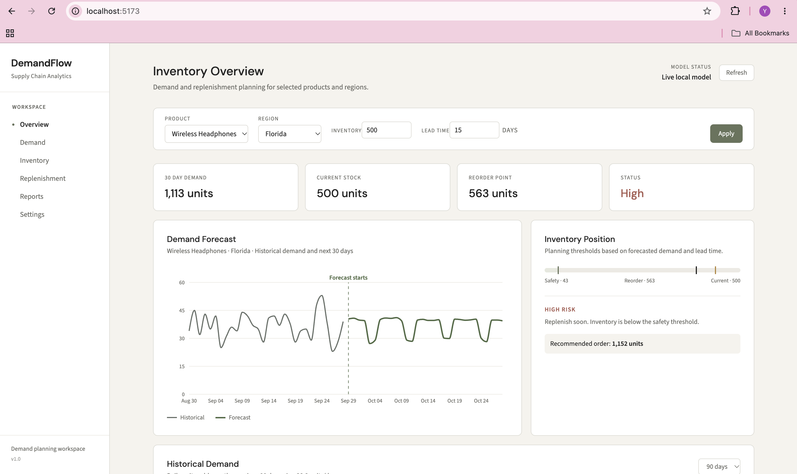
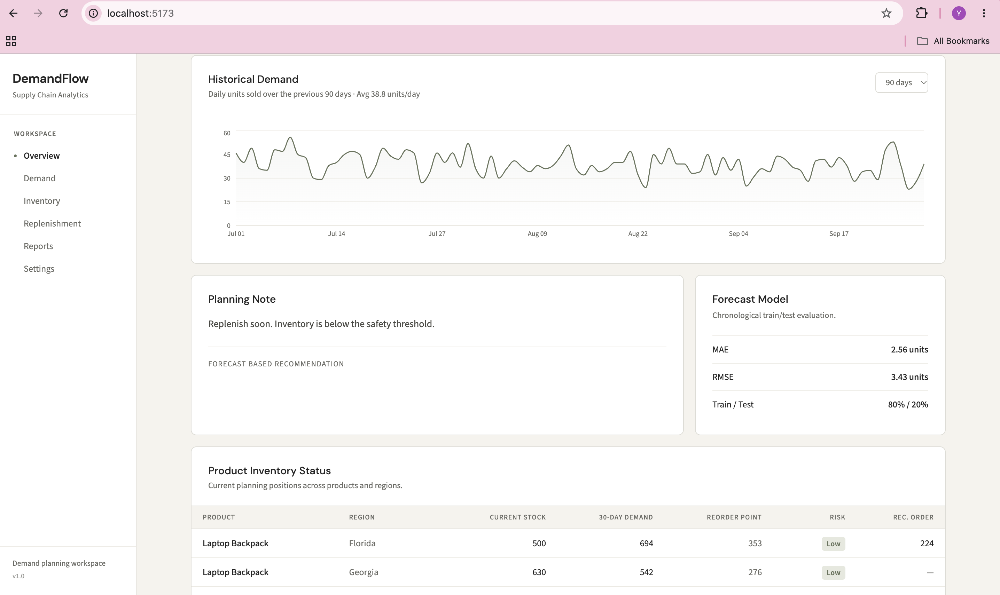

# DemandFlow

A full stack supply chain planning application that combines a React dashboard with a Python machine learning backend.

## Dashboard Preview






## Stack

Frontend:
- React
- TypeScript
- Vite
- Recharts

Backend:
- Python
- FastAPI
- Pandas
- NumPy
- Scikit-learn
- Random Forest

## What it does

- Generates a reproducible synthetic inventory demand dataset
- Builds lag and rolling demand features
- Trains a Random Forest demand forecasting model
- Evaluates the model with chronological train/test validation
- Produces a 30 day demand forecast
- Calculates safety stock and reorder point
- Calculates recommended replenishment quantity
- Classifies inventory risk
- Displays results in a professional supply chain dashboard

## Project structure

```text
DemandFlow/
├── frontend/
│   ├── src/
│   │   ├── App.tsx
│   │   ├── index.css
│   │   └── main.tsx
│   ├── package.json
│   └── vite.config.ts
├── backend/
│   ├── data/
│   ├── src/
│   │   ├── generate_data.py
│   │   ├── model.py
│   │   └── inventory.py
│   ├── main.py
│   └── requirements.txt
└── README.md
```

## Run locally

### 1. Backend

Open Terminal 1:

```bash
cd backend
python3 -m venv .venv
source .venv/bin/activate
pip install -r requirements.txt
uvicorn main:app --reload
```

Backend:
`http://localhost:8000`

API docs:
`http://localhost:8000/docs`

### 2. Frontend

Open Terminal 2:

```bash
cd frontend
npm install
npm run dev
```

Open the local Vite URL shown in the terminal, normally:

`http://localhost:5173`

## Notes

The dataset is synthetic and is generated automatically the first time the backend starts.

The Figma Make design was used as the frontend foundation. The dashboard's displayed forecast, inventory metrics, risk, and replenishment values are generated by the Python backend rather than hardcoded in the UI.
